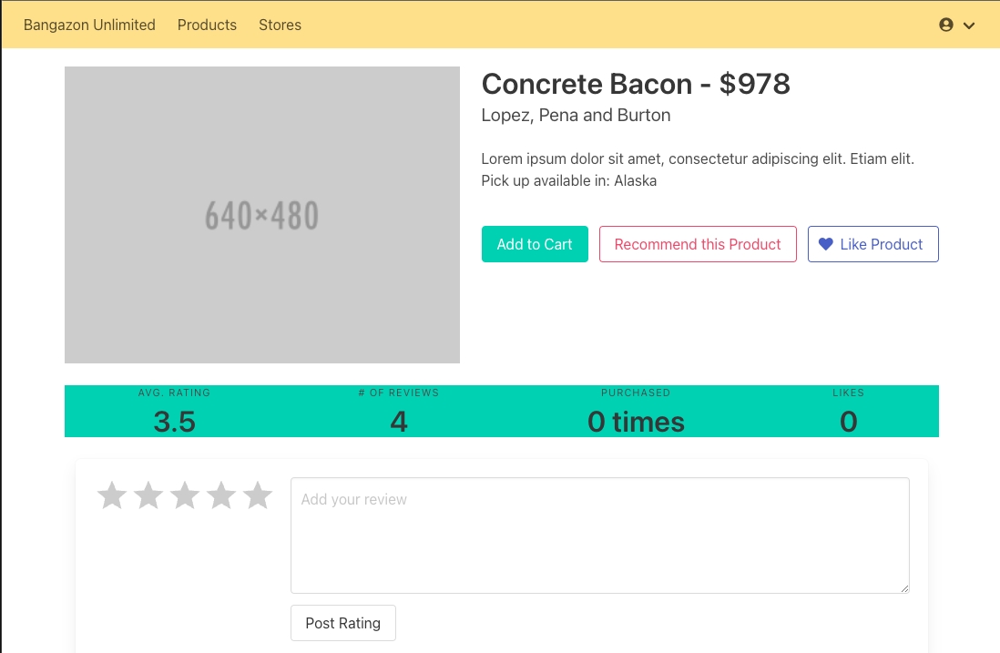
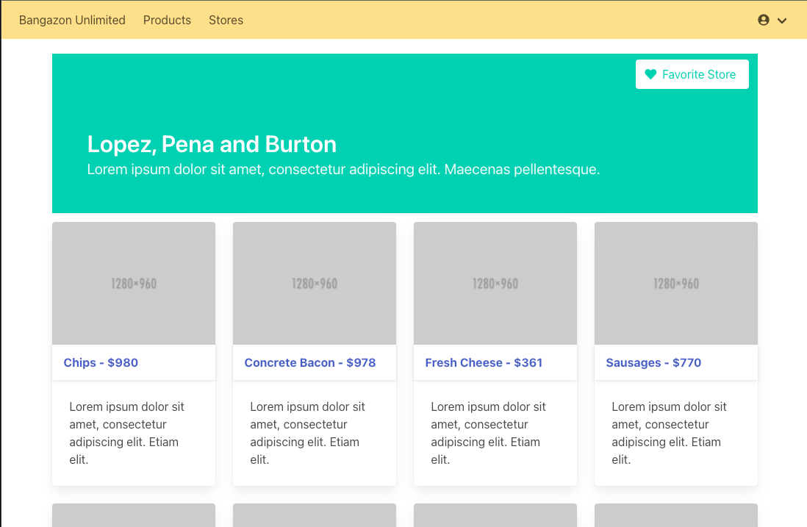

# Bangazon
Front end Application for my students to use when building their django rest api's. Built with Next.js styled with bulma

# Installation
```
npm install
npm run dev
```

# Examples





